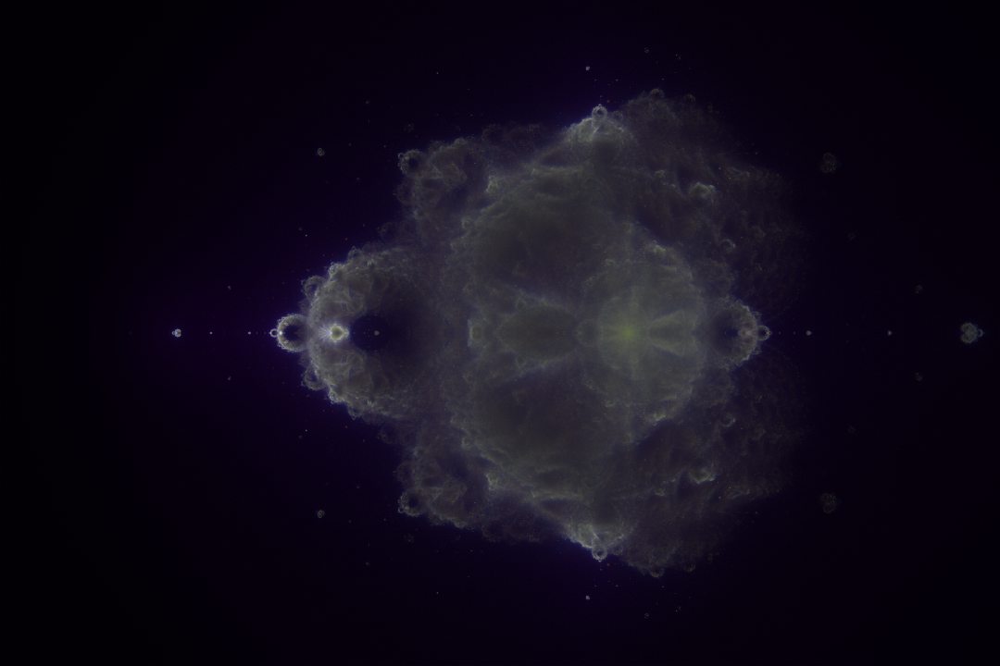
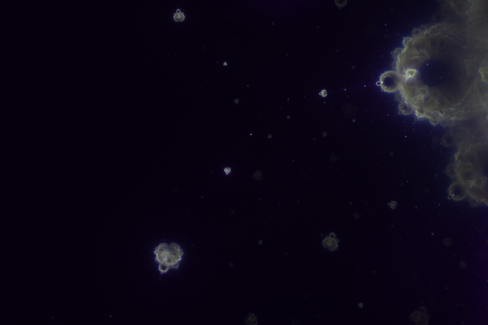

# Buddhabrot-GPU
Generate your own Buddhabrot fractals on the gpu!



## Usage

Compile using the provided Makefile and then run the executable

```bash
make
./buddha.out
```

### Keyboard bindings

- Select an area by holding down the left mouse button and then press the `a` key to render it
- You can tweak the current view using the arrow keys
- Go back to the previous view by pressing `z`
- Save the current view as a `.png` using `shift+W`
- You can also navigate the current render:
  - Zoom in and out with `w` and `s`
  - Move the view around by clicking the right mouse button
  - Reset to the initial view with `r`
- Exit the program with `q`
- For a full list of controls check out the source code in [fractalWindow.cpp](/src/fractalWindow.cpp)


